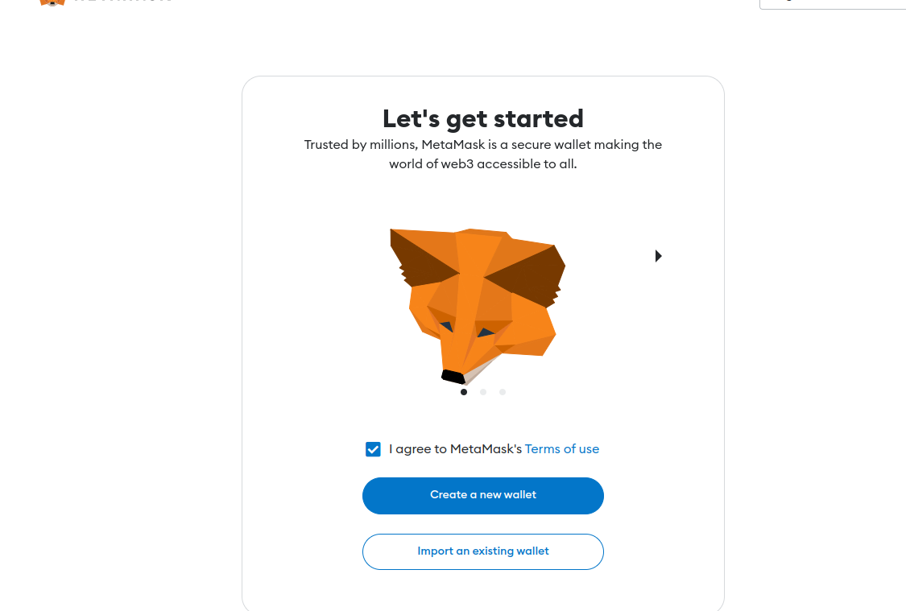

# UNIVERSITE NORMANDIE LE HAVRE

## Andoni ALONSO TORT
## MASTER 2 IWOCS
22/12/2022


## INSTRUCTIONS

Le projet consiste à créer un Smart Contract (SC) permettant de réaliser une enchère ascendante Hollandaise.
Une enchère ascendante hollandaise est un document électronique (RFx) [2] qui contient une liste d'articles que des acheteurs veulent vendre. Lors de cette enchère, le prix des articles diminue après des intervalles fixés jusqu'à ce que le prix réservé soit atteint. Avant que le prix réservé soit atteint, si le fournisseur fait une offre pour l'article, celui-ci est attribué à ce fournisseur et l'enchère est clôturée pour l'article.
Dans cette enchère, l'acheteur indique un prix de départ, une valeur de modification de prix, un intervalle de temps entre les modifications de prix et le prix réservé.
L'enchère s'ouvre avec le premier article avec le prix de départ spécifié et diminue selon la valeur de modification de prix (montant ou pourcentage) après un intervalle fixé. Le prix de départ diminue jusqu'à ce qu'un fournisseur fasse une offre ou que le prix de départ atteigne le prix réservé. Une fois l'enchère close pour l'article, l'enchère passe à un autre article de manière séquentielle.
L'enchère est clôturée lorsque la soumission d'offres pour tous les articles est terminée.


## ETAPES

1. Premierement  on va faire un fork du projet « dutch-auction » sur girlab :


2. Faire les installations requises

	2.2.NodeJs

	Si vous avez pas node installé, vous pouvez aller sur le site nodejs.org

    

    2.2 Installer GANACHE

	Ganache est une blockchain personnelle pour le développement rapide 	d'applications distribuées Ethereum et Filecoin. Vous pouvez utiliser Ganache tout au long 	du cycle de développement ; vous permettant de développer, déployer et tester vos dApps 	dans un environnement sûr et déterministe.
    <br/>
	Ganache est disponible en deux versions : une interface utilisateur et une CLI. 	Ganache UI est une application de bureau prenant en charge la technologie Ethereum et 	Filecoin. Notre outil de ligne de commande plus robuste, ganache, est disponible pour le 	développement d'Ethereum.
    <br/>
	
	- Telercharger
    https://trufflesuite.com/docs/ganache/quickstart/#1-install-ganache
    

	Une fois le fichier telecharger faire click droit dans le fichier et activer l’option de « Allow 	executing  file as program »
    <br/>
	Puis on peut écxecuter, on verra l‘écran suivant:
    <br/>

    

    <br/>
    Ici on sélectionnera NEW WORKSPACE avec ETHEREUM, puis on aure cet écran :
    <br/><br/>

    

    - Donner un nom au projet.
	- Appuyer sur « start ». 

    

    <br/>
    2.2 TRUFFLE

    <br/>
	Truffle est un environnement de développement de classe mondiale, un cadre de test et un pipeline d'actifs pour les blockchains utilisant la machine virtuelle Ethereum (EVM), visant à faciliter la vie des développeurs.

    https://trufflesuite.com/docs/truffle/quickstart/

    
    

    <br/><br/>
    Avant de continuer avec la création du projet, faire la dernière installation

    2.3 MetaMask
    <br>

    Un portefeuille Ethereum dans votre navigateur

    MetaMask est une extension permettant d'accéder aux applications distribuées compatibles Ethereum, ou « Dapps » dans votre navigateur !
    <br/>
    L'extension injecte l'API Ethereum web3 dans le contexte javascript de chaque site Web, afin que les dapps puissent lire à partir de la blockchain.

    Chercher dans les extensions de notre navigateur 
    

    

    Puis suivre les instructions :
        - Créer un mot de passe
        - Cliquer sur "Remind me later(not recommended)"

    

    Vous devriez avoir cette page :

    

3. Création du projet

Un fois tout installé on peut revenir sur https://trufflesuite.com/docs/truffle/quickstart/ à la partie "Create a projet" pour commencer notre projet

Vous pouvez créer un projet simple sans contrats intelligents à l'aide de truffle init, mais pour ceux qui débutent, vous pouvez utiliser des Truffle Boxes, qui sont des exemples d'applications et de modèles de projet. Nous utiliserons la boîte MetaCoin, qui crée un jeton pouvant être transféré entre comptes. Notez que ce n'est pas compatible ERC-20.

1. Telecharger ("unbox") la boîte MetaCoin :

```
truffle unbox metacoin [PATH/TO/DIRECTORY]
```

Une fois cette opération terminée, vous disposerez désormais d'une structure de projet avec les éléments suivants :

contrats/ : Annuaire des contrats Solidité
migrations/ : répertoire pour les fichiers de déploiement scriptables
test/ : Répertoire des fichiers de test pour tester votre application et vos contrats
truffle.js : fichier de configuration de truffe

Si vous utilisez VSCode vous pouvez installer l'extention solidity


